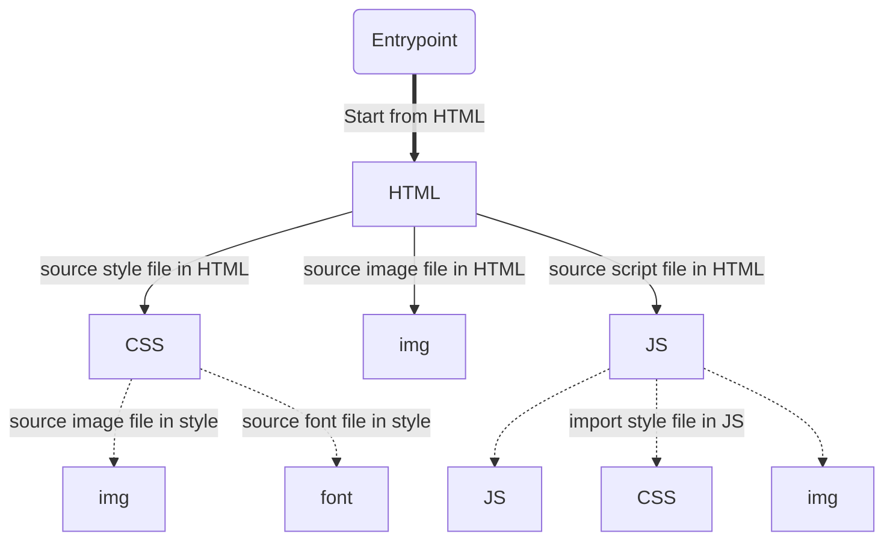

```mermaid
graph TD
    *(Entrypoint) ==>|Start from HTML|A[HTML]
    A -->|source style file in HTML|D[CSS]
    A -->|source image file in HTML|E[img]
    A -->|source script file in HTML|F[JS]
    D -.->|source image file in style|G[img]
    D -.->|source font file in style|J[font]
    F -.->K[JS]
    F -.->|import style file in JS|L[CSS]
    F -.->M[img]
```
